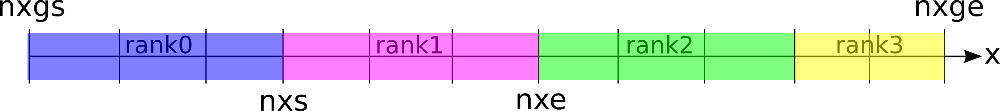

.. -*- coding: utf-8 -*-
.. $Id$

====================
1次元PICコード
====================

.. _em1d:

シリアル版
=============
1次元シリアル版コードは以下のような構成になっています。

.. blockdiag::

   diagram {
    node_width = 125;
    node_height = 25;
    span_width = 15;
    span_height = 15;

    "$PCANS_DIR/em1d/" -- "Makefile";
    "$PCANS_DIR/em1d/" -- "Makefile_inc";
    "$PCANS_DIR/em1d/" -- "common/"; 
    "$PCANS_DIR/em1d/" -- "moment/";
    "$PCANS_DIR/em1d/" -- "md_wave/"
    "$PCANS_DIR/em1d/" -- "md_shock/" ;
    "$PCANS_DIR/em1d/" -- "md_whistler/" ;
   }

Makefileは本1次元コードのバイナリ生成、削除をコントロールしています。初期化するには$PCANS_DIR/em1d内で、

.. code-block:: bash

   $ make clean

としてください。Makefile_incには、

.. code-block:: makefile

   FC = gfortran
   FFLAGS = -O2 

が記述されており、makeする際の環境変数が設定されています。ここでは、"$FC"にはFortranコンパイラ、"$FFLAGS"にはコンパイラオプションが設定されています。コンパイラとコンパイラオプションを変更したい場合は、例えば、

.. code-block:: makefile

   FC = ifort
   FFLAGS = -O3

のように修正してください。

シリアル版では、物理課題として「線形波動 (md_wave)」、「衝撃波 (md_shock)」、「電子温度異方性不安定 (md_whistler)」が用意されています（2012年3月現在）。各課題には、

.. blockdiag::

   diagram {
    node_width = 125;
    node_height = 25;
    span_width = 15;
    span_height = 15;

    "md_???" -- "Makefile","main.f90","const.f90","init.f90","dat/","mom/"
   }

が含まれており、それぞれの課題に沿った初期設定のサンプルが置かれています。"dat/"は計算結果の出力先で、電磁場と粒子データが出力されます。"mom/"は"dat/"内にある粒子データを元にモーメント計算をした時の出力先です。

例えば、衝撃波の計算を行うには、

.. code-block:: bash

   $ cd $PCANS_DIR/em1d/md_shock
   $ make
   $ ./a.out

とします。結果はFortran Unformatted形式で"dat/"内に出力されます。計算終了後にモーメントを計算するには、

.. code-block:: bash

   $ make moment

とします。自動的に"em1d/moment/"内のモーメント計算用のコードがコンパイルされ、計算が実行されます。結果はASCII形式で"mom/"内に出力されます。

パラメタ設定
-------------
各課題に含まれる"const.f90"では、シミュレーション定数が設定されています。

const.f90:

.. code-block:: fortran

   module const

      implicit none
      integer, parameter :: nx  = 1200  ! number of grid points
      integer, parameter :: np  = 15000 ! number of particles in each cell
      integer, parameter :: nsp = 2     ! number of particle species
      integer, parameter :: bc  = -1    ! boundary condition (periodic:0, reflective:-1)

   end module

nxはグリッド数、npは予想されるセル内の粒子数の最大値、nspは粒子種数で通常はイオンー電子系なので、nsp=2とします。bcは境界条件を指定するもので、 **pCANS** では周期境界（bc=0）と反射端（bc=-1）が選べます。

"initt.f90"では、シミュレーション変数が設定されています。例えば、"md_wave"の場合、

init.f90:

.. code-block:: fortran

   !*********************************************************************
   !   itmax   : number of iteration
   !   it0     : base count
   !   intvl1  : storage interval for particles & fields
   !   intvl2  : printing interval for energy variation
   !   intvl3  : printing interval for wave analysis
   !   dir     : directory name for data output
   !   file??  : output file name for unit number ??
   !           :  9 - initial parameters
   !           : 10 - for saving all data
   !           : 11 - for starting from saved data
   !           : 12 - for saving energy history
   !           : 13~14 - for w-k diagram
   !   gfac    : implicit factor
   !             gfac < 0.5 : unstable
   !             gfac = 0.5 : no implicit
   !             gfac = 1.0 : full implicit
   !*********************************************************************
   itmax  = 10240
   intvl1 = 512
   intvl2 = 20
   intvl3 = 20
   dir    = './dat/'
   file9  = 'init_param.dat'
   file10 = 'file10.dat'
   file12 = 'energy.dat'
   file13 = 'wk_by.dat'
   file14 = 'wk_bz.dat'
   gfac   = 0.505
   it0    = 0

   if(it0 /= 0)then
      !start from the past calculation
      file11 = '002048_file10.dat'
      call fio__input(up,uf,np2,c,q,r,delt,delx,it0,np,nx,nsp,bc,dir,file11)
      return
   endif

ここでは、ステップ数、出力先などが設定されています。各パラメタは上段のコメントに記述されています。"gfac"は、電磁場を陰解法で解くときのimplicit factorで、通常0.5より少し大きな値が設定されます。"it0"はステップ数のベースカウンタで、"it0=0"の時は最初から計算します。途中から計算を再開する時には、0以外の値を設定します。その場合は、直後のif文の中で"file11"で指定する中間ファイルを読み込み、計算を再開します。

その後、

init.f90:

.. code-block:: fortran

   !*********************************************************************
   !   r(1)  : ion mass             r(2)  : electron mass
   !   q(1)  : ion charge           q(2)  : electron charge
   !   c     : speed of light       ldb   : debye length
   !
   !   rgi   : ion Larmor radius    rge   : electron Larmor radius
   !   fgi   : ion gyro-frequency   fge   : electron gyro-frequency
   !   vti   : ion thermal speed    vte   : electron thermal speed
   !   b0    : magnetic field       
   !  
   !   alpha : wpe/wge
   !   beta  : ion plasma beta
   !   rtemp : Te/Ti
   !*********************************************************************
   pi   = 4.0*atan(1.0)
   delx = 1.0
   c    = 1.0
   delt = 1.0
   ldb  = delx

   r(1) = 16.0
   r(2) = 1.0
   alpha = 2.0
   beta  = 0.04
   rtemp = 1.0

では、各物理変数（コメント内に詳述）が設定されています。これらを元にその他の物理変数を求めていきます。さらに、

init.f90:

.. code-block:: fortran

   np2(1:nx+bc,1) = 12500
   np2(1:nx+bc,2) = np2(1:nx+bc,1)

では、初期のセル当たりの粒子数を設定しています。これは、"const.f90"内で設定している"np"より小さくなるように注意してください。"np2"は計算途中で粒子が移動するに伴い変動し、位置によって値が異なるため、"np"をあらかじめ大きめにとり計算途中でも :math:`{\rm np > max(np2)}` となるようにしてください。

.. _em1d_moment:

モーメント計算
---------------
"moment/"内には、粒子データからモーメントを計算するプログラムが格納されています。各課題で計算が終わったのち、

.. code-block:: bash

   $ make moment

としてください。"dat/"内にある粒子と電磁場データを読み込み、計算結果を"mom/"内に出力します。Makefile内の該当個所は、

.. code-block:: makefile

   ############## moment calculation ################
   moment : $(LIB_DIR)/moment/mom.out
           $(LIB_DIR)/moment/mom.out ./dat/ `cd dat; \ls *_file10.dat`
   
   $(LIB_DIR)/moment/mom.out :
           cd $(LIB_DIR)/moment ; make
   ###############################################

です。デフォルトでは"dat/"内にある粒子データを全て計算することになりますが、"\`cd dat; \\ls \*_file10.dat\`"を修正することにより、任意の時間ステップにおける粒子・電磁場データに対して、モーメント計算を行います。

モーメント計算は、密度（0次モーメント）、

.. math::

   n(x) = \int f(x,{\bf v}) d{\bf v}

速度（1次モーメント）、

.. math::

   {\bf V}(x) = \frac{1}{n(x)}\int {\bf v} f(x,{\bf v}) d{\bf v}

温度（2次モーメント）、

.. math::

   T_{xx}(x) = \frac{1}{n(x)}\int v_x^2 f(x,{\bf v}) dv -V_x(x)^2 \\
   T_{yy}(x) = \frac{1}{n(x)}\int v_y^2 f(x,{\bf v}) dv -V_y(x)^2 \\
   T_{zz}(x) = \frac{1}{n(x)}\int v_z^2 f(x,{\bf v}) dv -V_z(x)^2

に従って計算します。

.. _em1d_mpi:

MPI並列版
=============
1次元MPI並列版コードは以下のような構成になっています。

.. blockdiag::

   diagram {
    node_width = 150;
    node_height = 25;
    span_width = 15;
    span_height = 15;

    "$PCANS_DIR/em1d_mpi/" -- "Makefile";
    "$PCANS_DIR/em1d_mpi/" -- "Makefile_inc";
    "$PCANS_DIR/em1d_mpi/" -- "common/"; 
    "$PCANS_DIR/em1d_mpi/" -- "moment/";
    "$PCANS_DIR/em1d_mpi/" -- "md_wave/"
    "$PCANS_DIR/em1d_mpi/" -- "md_whistler/" ;
   }

基本的な使い方は :ref:`シリアル版 <em1d>` と同じです。

領域分割法による並列化
-----------------------

MPI並列版では、上図のように、プロセス数に従って1次元（x方向）方向に領域を区分化し、各領域にある粒子の運動と場の発展を各プロセス（Rank）が分担することにより、並列化を行っています。MPI並列化による違いを以下に示します。

.. note::
      
   1次元コードに対して領域分割をすると、系の発展に伴う粒子数の不均一化によって各プロセスの計算負荷が大きく異なるケースがあります（例：衝撃波）。その場合、一番大きな負荷のプロセスによって計算時間が決まるため、並列化効率が落ちることが知られています（ロードバランスの非均衡化）。 **pCANS** では、並列化プログラム例として1次元コードでも領域分割した並列化版コードを用意しています。

パラメタ設定
---------------
シミュレーション定数の設定（const.f90）は、以下のようになっています。

const.f90:

.. code-block:: fortran

   module const
   
     implicit none
     integer, parameter :: nx    = 2048      ! number of grid points
     integer, parameter :: nxgs  = 2         ! start point
     integer, parameter :: nxge  = nxgs+nx-1 ! end point
     integer, parameter :: np    = 25000     ! number of particles in each cell
     integer, parameter :: nsp   = 2         ! number of particle species
     integer, parameter :: nproc = 4         ! number of processors
     integer, parameter :: bc    = 0         ! boundary condition (periodic:0, reflective:-1)
   
   end module

MPI並列版では、"nxgs"と"nxge"が設定されていて、グリッド番号の最初の値（nxgs）を任意に指定しています。"nproc"はプロセス数で、MPIで並列化するプロセス数を指定します（この例では4並列）。各担当領域を表す"nxs"、"nxe"（上図参照）は、init.f90内で、"nxgs"、"nxge"、"nproc"から求めています。

init.f90:

.. code-block:: fortran

   !************** MPI settings  *******************!
       call mpi_set__init(nxgs,nxge,bc,nproc)
       if(nrank == nproc-1)then
          if(bc == -1) bcp = -1
          if(bc ==  0) bcp = 0
       else
          bcp = 0
       endif
       allocate(np2(nxs:nxe+bcp,nsp))
       allocate(uf(6,nxs1:nxe1))
       allocate(up(4,np,nxs:nxe+bcp,nsp))
       allocate(gp(4,np,nxs:nxe+bcp,nsp))
   !*********** End of MPI settings  ***************!

その他のユーザーが設定するパラメタは、 :ref:`シリアル版 <em1d>` と同じです。実行手続きは、

.. code-block:: bash

   $ cd $PCANS_DIR/em1d_mpi/md_wave
   $ make
   $ mpiexec -n 4 ./a.out

と、最後の実行コマンドがシリアル版と違います。"-n"で並列数をしてしており、ここで与える数と上記の"nproc"の数が一致する必要があります（コード内で両数字が合っているかチェックしており、違う場合は終了します。）

モーメント計算
---------------
モーメント計算も、基本的には :ref:`シリアル版 <em1d_moment>` と同じですが、

.. code-block:: bash

   $ make moment
   cd ../moment ; make
   make[1]: ディレクトリ ~/pcans/em1d_mpi/moment に入ります
   mpif90 -O2 -c boundary.f90 
   mpif90 -O2 -c particle.f90 
   mpif90 -O2 -c fio.f90 
   mpif90 -O2 -c mom_calc.f90 
   mpif90 -O2 -c main.f90 
   mpif90 -o mom.out -O2 boundary.o particle.o main.o mom_calc.o fio.o
   make[1]: ディレクトリ ~/pcans/em1d_mpi/moment から出ます
   ../moment/mom.out ./dat/ `cd dat; \ls *_rank*.dat`
   No. of processes?

のように、最後にプロセス数（並列数）が聞かれますので、ここで"mpiexec -n"で指定した並列数（上記例の場合は4）を入力して下さい。結果は同様に、"mom/"内に出力されます。

