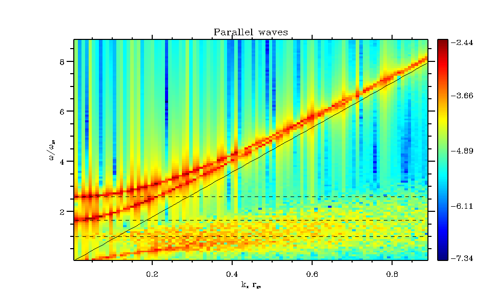

線形波動
--------------------
:Author: Yosuke MATSUMOTO (Chiba Univ.)

"md_wave"では、粒子の熱擾乱による線形波動の励起計算行っている。計算の実行手続きは、

.. code-block:: bash

   $ cd $PCANS_DIR/em1d/md_wave
   $ make
   $ ./a.out

のようにして行う。計算結果を、空間−時間方向にフーリエ変換することにより、プラズマの固有波動の分散関係を数値的に得ることができる。下記では、その計算結果例を示す。（MPI並列版でも同様であるので、以下ではシリアル版についてのみ説明する。）

パラメタ設定
^^^^^^^^^^^^^
本計算例でのパラメタ設定を以下に示す。

const.f90:

.. code-block:: fortran

   implicit none
   integer, parameter :: nx  = 2048 ! number of grid points
   integer, parameter :: np  = 1000 ! number of particles in each cell
   integer, parameter :: nsp = 2    ! number of particle species
   integer, parameter :: bc  = 0    ! boundary condition (periodic:0, reflective:

init.f90:

.. code-block:: fortran

    itmax  = 2048
    intvl1 = 1024
    intvl2 = 1024
    intvl3 = 6
    dir    = './dat/'
    file9  = 'init_param.dat'
    file10 = 'file10.dat'
    file12 = 'energy.dat'
    file13 = 'wk_by.dat'
    file14 = 'wk_bz.dat'

    pi   = 4.0*atan(1.0)
    delx = 1.0
    c    = 1.0
    delt = 1.0
    ldb  = delx

    r(1) = 16.0
    r(2) = 1.0

    alpha = 2.0
    beta  = 0.05
    rtemp = 1.0

    np2(1:nx+bc,1) = 500
    np2(1:nx+bc,2) = np2(1:nx+bc,1)

本課題に固有なパラメタとして、"intvl3"、"file13"、"file14"が設定されている。intvl3は、サブルーチンwk_f（wk.f90）によって行われる電磁場データの出力頻度で、フーリエ解析で読み込むデータとして使われる。出力頻度は、求めたい波動の振動数によって調整する。シミュレーションパラメタは"dat/init_param.dat"に出力されているので、こちらを参照して決定する。"file13"及び"file14"は、wk_fで出力するファイル名で、本例では横波成分（背景磁場は :math:`{\bf B} = (B_0,0,0)` ）を出力するので、上記のように指定している。解析するデータを修正するには（例えば、縦波成分、電場）、wk.f90の出力部分

wk.f90:

.. code-block:: fortran

   !save data for w-k diagram
   write(13,'(100000e13.4)')(uf(2,i),i=1,nx)
   write(14,'(100000e13.4)')(uf(3,i),i=1,nx)
   
の箇所を変更する。

フーリエ解析
^^^^^^^^^^^^^
得られた結果をIDLによって読み込み、解析を行う。まずは、md_wave内で

.. code-block:: bash

 $ idl

 IDL Version 6.4 (linux x86_64 m64). (c) 2007, ITT Visual Information Solutions
 Installation number: 705264.
 Licensed for use by: CHIBA-U
 
 % Compiled module: LOADCT.
 % Compiled module: FILEPATH.
 % Compiled module: PATH_SEP.
 % Compiled module: SET_X.

 IDL> 

のようにしてidlを起動する。データの読み込みは、

.. code-block:: bash

 IDL> input = file_read('dat/wk_by.dat')
 column:        2048
 line:         342
       0.  dat/wk_by.dat  Reading......

で行う。読み込んだデータ（input）を元に分散関係を描くプロシージャが同ディレクトリ内に用意されている（w_k_1d.pro）。ユーザーが指定するのは、同プロシージャの頭で設定されている物理パラメタで、

w_k_1d.pro:

.. code-block:: fortran

 ;; DATA INFORMATION
 dx = 1.0
 dt = 6.0
 c = 1.0D0
 mr = 1.D0/16.D0
 vai = 1.25D-1
 vae = vai/sqrt(mr)
 wgi = 2.47D-3
 wge = wgi/mr
 wpi = c/vai*wgi
 wpe = c/vae*wge
 beta = 0.05

の部分を、"dat/init_param.dat"を参照して設定する。

.. code-block:: bash

 IDL> .r w_k_1d

を行うと、

のように分散関係が得られる。破線は上から順に、R、Lモードのカットオフ周波数、電子ジャイロ周波数を指す。実線は、 :math:`\omega=ck` の真空中の電磁場モードを示している。本計算では、磁場に対して平行に伝搬する横波の分散関係を描いており、上から順に高周波Rモード, Lモード、whistler波といった、冷たいプラズマの分散関係が得られている。

初期設定の磁場配位（本計算例では、 :math:`{\bf B} = (B_0,0,0)` ）を変えたり、解析する物理変数を変えることにより、その他の固有モードの分散関係を得ることができる。また、長時間計算することにより、上図ではつぶれてよく見えないイオン波動についても再現が可能である。プラズマ温度（β）を上げることにより、暖かいプラズマの分散関係を調べるのも、おもしろい課題である（例：Bernstein波）。

