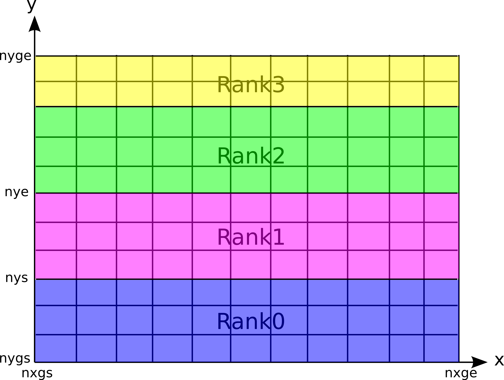

===================
2次元PICコード
===================
2次元コードはMPI並列版のみで、以下のような構成になっています。

.. blockdiag::

   diagram {
    node_width = 150;
    node_height = 25;
    span_width = 15;
    span_height = 15;

    "$PCANS_DIR/em2d_mpi/" -- "Makefile";
    "$PCANS_DIR/em2d_mpi/" -- "Makefile_inc";
    "$PCANS_DIR/em2d_mpi/" -- "common/"; 
    "$PCANS_DIR/em2d_mpi/" -- "moment/";
    "$PCANS_DIR/em2d_mpi/" -- "psd/";
    "$PCANS_DIR/em2d_mpi/" -- "md_wave/"
    "$PCANS_DIR/em2d_mpi/" -- "md_shock/" ;
    "$PCANS_DIR/em2d_mpi/" -- "md_kh/" ;
   }

基本的な使い方は :ref:`1次元MPI並列版 <em1d_mpi>` と同じです。2次元コードによる違いを以下に示します。

領域分割法による並列化
-----------------------

2次元コードでは、 y方向に1次元的に領域を区分化し、各領域にある粒子の運動と場の発展を各プロセス（Rank）が分担することにより、並列化を行っています（上図）。

.. note::

   領域分割による粒子コードの並列化では、系の発展に伴う粒子数の不均一化によって各プロセスの計算負荷が大きく異なることが考えられます。その場合、一番大きな負荷のプロセスによって計算時間が決まるため、並列化効率が落ちることが知られています（ロードバランスの非均衡化）。各物理課題では、y方向になるべく粒子数の偏りが少なくなるような初期設定をする必要があります（背景流れ場、磁場の向きなど）。

パラメタ設定
---------------
シミュレーション定数の設定（const.f90）は、以下のようになっています。

const.f90:

.. code-block:: fortran

   module const
   
     implicit none
     integer, parameter :: nx    = 128       ! number of grid points in x
     integer, parameter :: ny    = 128       ! number of grid points in y
     integer, parameter :: nxgs  = 2         ! start point in x
     integer, parameter :: nxge  = nxgs+nx-1 ! end point
     integer, parameter :: nygs  = 2         ! start point in y
     integer, parameter :: nyge  = nygs+ny-1 ! end point
     integer, parameter :: np    = 150*nx    ! number of particles in each cell
     integer, parameter :: nsp   = 2         ! number of particle species
     integer, parameter :: nproc = 4         ! number of processors
     integer, parameter :: bc    = -1        ! boundary condition in x (0:periodic, -1:reflective)
   
   end module

"nx"、"ny"はそれぞれx、y方向のグリッド数を設定します。"nxgs"、"nygs"はそれぞれx、y方向のグリッド開始番号を指定しています。本コードでは、2次元領域分割は行わず、y方向に1次元領域分割をしています（上図）。また、y方向は周期境界条件を仮定しています（x方向はbcで指定可能）。このような制限があるものの、多くの2次元物理問題に対して適用可能です（衝撃波、磁気リコネクション、KH不安定など）。
