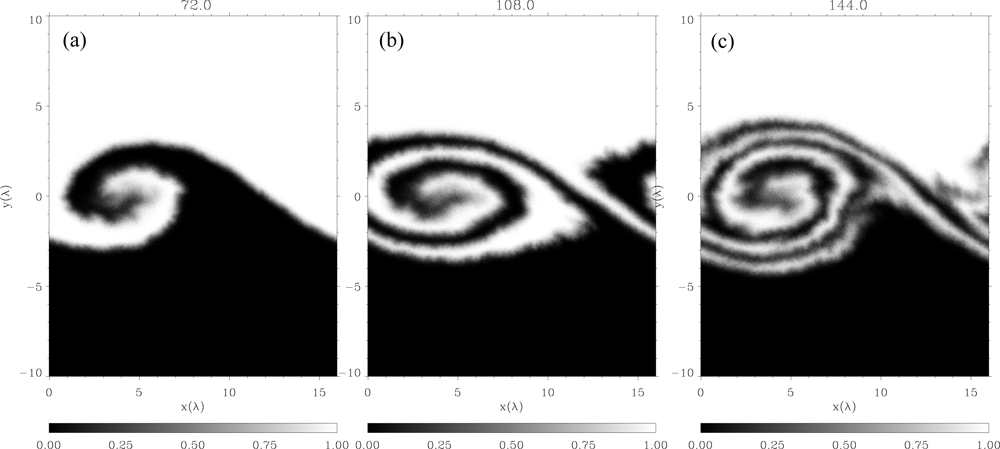
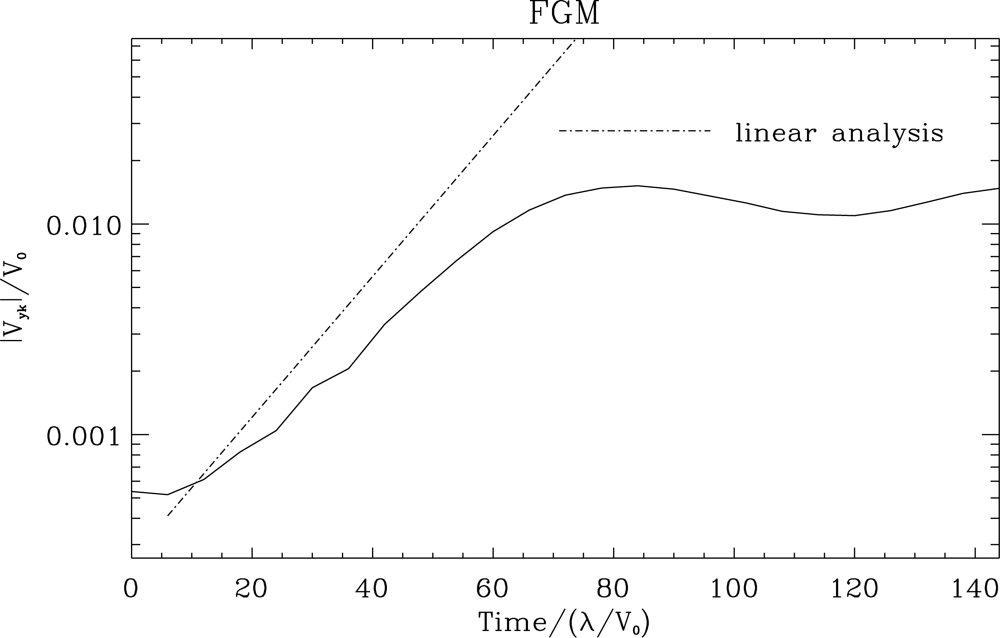
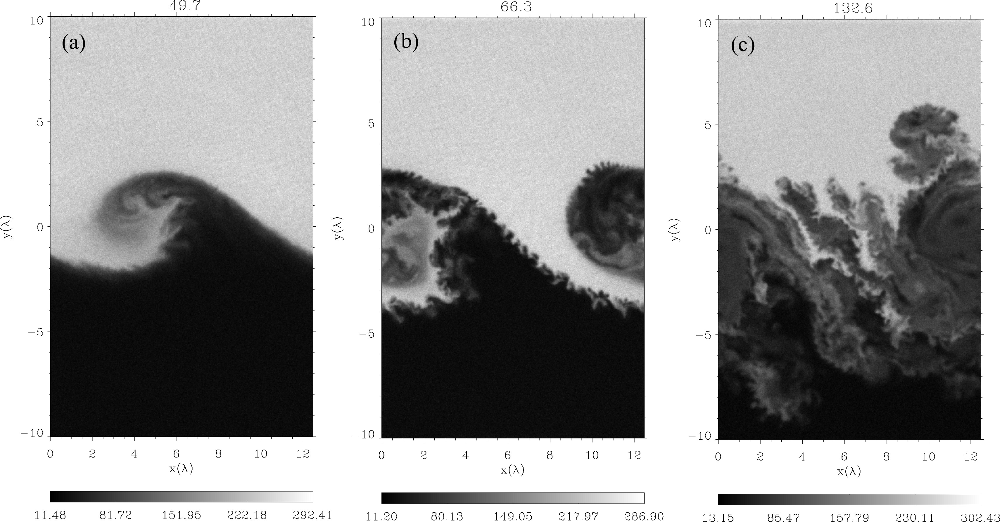
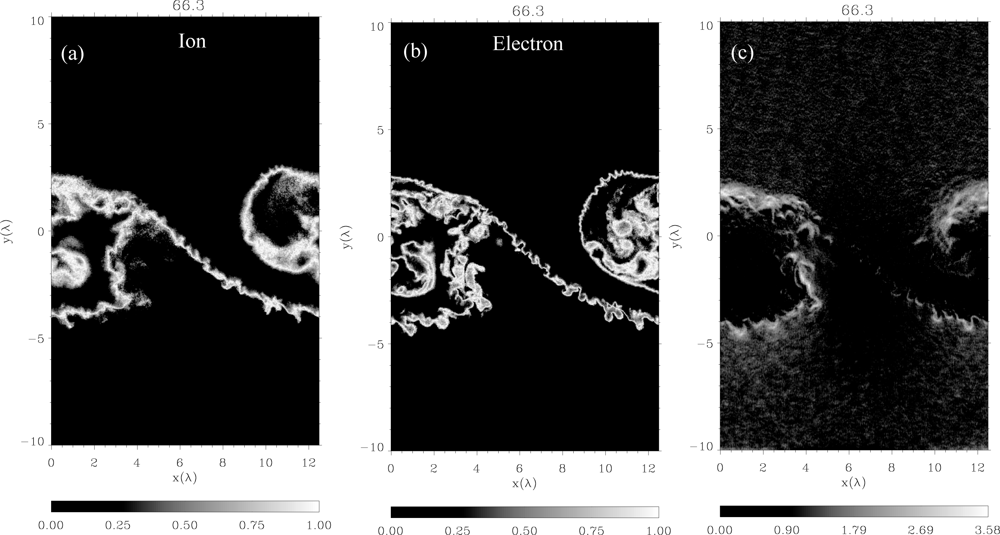

Kelvin-Helmholtz instability
-----------------------------
 :Authors: Yosuke MATSUMOTO (Chiba Univ.)

二つの運動している媒体が相対速度を持って接している場合、境界領域においては速度シア層が形成される。その速度シア境界は擾乱に対して不安定であることが19世紀後半より知られており、これを初期の研究者の名前から因んでケルビン−ヘルムホルツ（Kelvin-Helmholtz、以下KH）不安定と言う。速度シア境界は、地球大気中から天体現象において普遍的に存在し、KH不安定の発達は幅広い領域において応用されている。本巻で取り扱う実験室や宇宙空間でのプラズマ現象においても例外ではなく、速度シア層が存在するプラズマ物理領域に置いてKH不安定が成長し、各領域において重要な役割を果たしている。

KH不安定自体は流体的不安定であるため、プラズマ中でのKH不安定の非線形発展については主に電磁流体（Magnetohydrodynamic、以下MHD）シミュレーションによる研究が行われている。例えば、活動銀河核などから放出される宇宙ジェットのMHDシミュレーションが多く報告されているが、KH不安定がジェットの安定性に大きな影響を与えていることが明らかになっている\cite{Ferrari_1998,Baty_2003}。このようなMHDシミュレーションによるアプローチは、太陽風と接する地球磁気圏境界において成長するKH不安定に対しても適用されてきた。しかしながら、本研究領域において重要となる、磁場を横切った無衝突プラズマの輸送過程はMHDシミュレーションでは記述できない現象である。そこで、個々のプラズマ粒子の運動を記述する
粒子シミュレーションによる研究が近年始まってきており、無衝突プラズマの混合・輸送過程がどのような物理過程によって担われているかを明らかにすることを目指し、研究が行われている。
本項では、KH不安定の粒子シミュレーションを取り上げ、以下にその計算例を示す。

線形理論
^^^^^^^^^^^^^
数値計算による非線形発展を示す前に、線形理論から導かれる不安定条件と成長率を示す。これらは数値計算の初期設定、計算結果の妥当性を確認するのに有益である。

いま、プラズマが :math:`x` 方向に流れ、速度が :math:`y` 方向に差し渡し :math:`V_0` 変化している速度シア層を考える。また、背景磁場は :math:`{\bf B_0}=(B_{0x},0,B_{0z})` の成分を持つ。このようなプラズマ中でのKH不安定の成長は、磁場の存在とプラズマの圧縮性に大きく影響を受ける（詳しくは文献 Chandrasekhar, 1961; Miura & Pritchett, 1982を参照のこと）。

ここで、2つの特別なケースを考えよう。まずは、背景磁場が背景速度と同じ方向に向いている場合、すなわち :math:`{\bf B_0}=(B_{0x},0,0)` の場合、速度シアの大きさについて

.. math::

 V_A < \frac{V_0}{2} < C_S

の条件を満たす場合に不安定となる。ここで :math:`V_A=|\vec{B_0}|/\sqrt{\mu_0\rho_i}` はAlfven速度、 :math:`C_S=\sqrt{\gamma P_i/\rho_i}` は音速である（ :math:`\rho_i` 、 :math:`P_i` 、 :math:`\gamma` はそれぞれイオン密度、圧力、比熱比である）。速度シアの大きさ :math:`(V_0/2)` が  :math:`V_A` より大きい必要があるのは、速度場の面内に磁場が存在すると磁気張力が安定化の働きをもたらすためであると直感的にも理解できる。また音速で制限されているのは、プラズマの圧縮性による安定化の効果である。このことから、平行磁場（ :math:`\vec{V_0} // \vec{B_0}` ）の場合は高 :math:`\beta` プラズマ、例えば、宇宙ジェットのような弱い磁場領域に適用される。ここで、 :math:`\beta = \frac{P_i+P_e}{P_{mag}}` はイオンの圧力 :math:`P_i \equiv \frac{1}{2}m_iV_{ti}^2` と電子の圧力 :math:`P_e \equiv \frac{1}{2}m_eV_{te}^2` の和であるプラズマ圧力と磁気圧力 :math:`P_{mag} \equiv {|\vec{B}|^2}/{(2\mu_0)}` との比である。

一方、垂直磁場（ :math:`\vec{V_0} \perp \vec{B_0}` ）の場合は

.. math::

 \frac{V_0}{2} < V_f = \sqrt{V_A^2+C_S^2}

が不安定条件であり、亜磁気音速の流れであれば常に不安定である。このような条件は様々なプラズマ :math:`\beta` 領域に適用可能であり、特に低緯度磁気圏境界においてはこの条件が満たされていると考えられている。現実には波数ベクトル、磁場、流れの向きが様々であり、それぞれの状況において不安定条件は違うが、一般に垂直磁場条件が最も不安定であり、平行磁場条件が最も安定化されやすい。

KH不安定の成長率は上記条件に加え、速度シアの厚みが時間スケールを決める。以下では、数値シミュレーションでも用いられる一般的な速度シアの関数に対する成長率を求める。シミュレーションでは初期条件として

.. math::

 V_x = -\frac{V_0}{2}\tanh{\left(\frac{y}{\lambda} \right)}

の形で速度プロファイルがしばしば与えられる。また、ここでは垂直磁場配位 :math:`\vec{B}=(0,0,B_0)` を考えよう。プラズマの圧力はプラズマ :math:`\beta` より決まり、密度と共に一様に与える。このような条件の下でMHD方程式を線形化し、得られた線形MHD方程式を固有値問題として数値的に解くことにより固有値（成長率）と固有関数が得られる（詳細は省く）。

.. figure:: linear_kh.png
   :width: 800px
   :align: center

..   KH不安定の成長率とそれに対応する不安定モード。横軸は速度シアの厚み :math:`\lambda` で規格化された波数、縦軸は :math:`\lambda/V_0` で規格化された成長率。

上図は、 :math:`\beta=2.0` 、 :math:`V_0/V_f=1.0` の場合の成長率とそれに対応する不安定モードを表す。これより、最大成長率は :math:`\gamma \lambda/V_0=0.077` であり、対応する不安定モードは :math:`k_x\lambda=0.4` であることがわかる。これらを元に計算領域のサイズを決める。また、計算結果から得られた成長率を求めることにより、計算の妥当性のチェックを行う。

以上は理想MHD近似の下での結果である。これらMHD的特性に加え、速度シアの厚みがイオンスケール程度まで薄い場合には、イオンの慣性効果 \cite{Fujimoto_Terasawa_1991}、イオンの有限ラーマー半径効果 \cite{Huba_1996b} などが、不安定モードや成長率に影響を与える。特に、二つの媒質中の磁場強度が違う場合は、磁場と渦度の内積 :math:`\vec{B} \cdot \nabla \times \vec{V_0}` の符号により、成長率が増減することが報告されている。また薄い速度シア層の場合は粒子シミュレーションにおいて初期平衡状態を設定する際に工夫が必要であることも指摘されている{\cite{Pritchett_Coroniti_1984,Cai_1993a}。本小節ではこれらの影響が少ない、比較的厚いシア層について取り扱う。

以下では粒子シミュレーションによる計算例を示す。まず最初に、上記線形理論で示した条件の下での計算結果を示し、線形理論との一致を確認する。この計算では古典的な渦形成が非線形発展として特徴づけられ、得られる描像はMHD的である。次に、粒子シミュレーションによるマルチスケール現象の例として、KH不安定の乱流発展の計算例を示す。

**ベンチマークテスト**
^^^^^^^^^^^^^^^^^^^^^^^
まず最初の例では線形理論で用いた条件を初期設定とする。すなわち、流体的物理量として

.. math:: 

 \vec{V_0} &= (V_{0x},0,0) \\
 \vec{B_0} &= (0,0,B_{0z}) \\
 V_{0x}(y) &= -\frac{V_0}{2}\tanh\left(\frac{y}{\lambda}\right) \\
 V_0 &= V_f \\
 \beta &= 2.0  \\
 \frac{P_i}{P_e} &= 1.0

となるように粒子を配置する。また、プラズマ固有のパラメタとして

.. math:: 

 m_i/m_e &= 16 \\
 \omega_{pe}/\omega_{ce} &= c/V_{Ae} = 1.4 \\
 \lambda/r_{ci} &= 4.0\\
 N_{i} &= N_{e} = 120 /(\Delta x\Delta y)

を以下に続く計算では採用する。ここで上から順に、イオン・電子質量比、電子プラズマ−ジャイロ振動数比、イオンジャイロ半径に対するシアの厚み、およびセルあたりの各種の粒子数を表す。特に式（\ref{eqn:width}）では、速度シアの厚み :math:`\lambda` をイオンジャイロ半径の4倍とることにより、初期平衡状態、線形成長がMHD的描像で与えられる（以上の設定では式（\ref{eqn:mass_ratio}）や式（\ref{eqn:frequency_ratio}）の無次元量は系の発展に影響は及ぼさない）。

粒子は一様に配置し、速度はシフトしたマクスウェル分布

.. math::

 f = \left(\frac{1}{2\pi v_{t}^2}\right)^{3/2} \exp\left(-\frac{(v_x-V_{0x}(y))^2+v_y^2+v_z^2}{2v_{t}^2}\right)

となるように与える。速度シアがあり、速度場の面に対して垂直な磁場がある場合、対流電場 :math:`\vec{E_0} = (0,E_{0y},0)` は空間的に非一様になるため、ガウスの法則

.. math::

 \nabla \cdot \vec{E_0} &= \frac{\partial E_{0y}}{\partial y}  \\
 &= \frac{\partial}{\partial y}\left(V_{0x}B_{0z}\right) \\
 &= \frac{q(n_i-n_e)}{\epsilon_0}

を満たす必要がある。したがって、システム全体としては電荷中性にはならない。ここでは電子個数密度を調整する。具体的には式（\ref{eqn:vshear}）より、

.. math::

 n_i(y) - n_e(y) = -\frac{\epsilon_0 B_0 V_0}{2q c\lambda}\cdot\frac{1}{{\rm cosh}^2\left(y/\lambda\right)}

となるように電子の数を加える。任意の関数の頻度分布（速度、空間分布）になるように粒子を配置するには累積分布関数（cumulative distribution function）を用いる\cite{Birdsall,Cartwright_2000}。粒子を配置する場合、結果として任意の分布 :math:`f(y)` となるようにするには、

.. math::

 R = F(y) = \frac{\int_{-y_b}^yf(y')dy'}{\int_{-y_b}^{+y_b}f(y')dy'} \\
 \label{eqn:cumulative_distribution}

より、 :math:`y` を求める。ここで :math:`0 \le \le 1` Rの一様分布を持つ数（例えば一様乱数）、 :math:`\pm y_b` は :math:`y` 方向の境界を表し、 :math:`F(-y_b)=0` 、 :math:`F(+y_b)=1` である。右辺の分子を解析的または数値的に求めることにより、頻度分布が :math:`f(y)` となるような :math:`R` に対する位置 :math:`y` を求めることができる。

線形解析で得られた最大成長率モード :math:`k_x\lambda=0.4` より、シミュレーション領域の :math:`x` 方向のサイズは :math:`L_x=15.7\lambda \sim 512\Delta x` とし、 :math:`y` 方向のサイズは :math:`L_y = \pm 10\lambda = 641\Delta y` とする。境界条件は、 :math:`x` 方向は周期境界、 :math:`y` 方向は反射端境界とした。グリッドサイズは通常どおりデバイ長程度（ :math:`\Delta x = \Delta y = \Delta = \lambda_{De}` ）に設定する。時間刻みは陰的FDTD法を用いると比較的大きくとることができ、ここではクーラン数として :math:`c \Delta t = \Delta x,y` とした。

.. role:: ref

.. role:: label

.. raw::  latex

  \newcommand*{\docutilsroleref}{\ref}
  \newcommand*{\docutilsrolelabel}{\label}

..   (a)-(c)は粒子シミュレーションによるKH不安定の時間発展を表す。初期の粒子の位置により色分けしており、 :math:`y(t=0) > 0` の粒子は白色、 :math:`y(t=0) \le 0` の粒子の色は黒色を示している。境界付近は両粒子が混合しているため混合率に比例した中間色を示している。

図はKH不安定の非線形発展を表す。初期の粒子（イオン）の位置により色分けしており、 :math:`y(t=0) > 0` の粒子は白色、 :math:`y(t=0) \le 0`の粒子の色は黒色を示している。境界付近は両粒子が混合しているため混合率に比例した中間色を示している。MHDシミュレーションと同様、粒子シミュレーションにおいても速度シア層から渦が成長し、二つの媒質を巻き込むようにして混合していく様子が見られる。

   
..   最大成長率モードのフーリエ振幅の時間発展

得られた計算結果の妥当性を調べるため、速度擾乱成分である$V_y$を$x$方向にフーリエ変換し、 :math:`y` 方向に平均化した最大成長率モード(モード数１）のフーリエ振幅の時間発展を調べたのが上図である。また比較のため、線形解析で得られた成長率（ :math:`\gamma \lambda/V_0=0.077` ）の傾きを同時にプロットした。結果、粒子シミュレーションで得られた最大成長率モードの線形成長率は理想MHD近似での線形解析結果に近いことがわかる。また非線形段階での振幅の振動はMHDシミュレーションで見られる特徴である\cite{Miura_Sato_1978}。これらの結果は、初期条件がMHD近似に近い条件であるため、得られる結果はMHD的描像であることがわかる。

マルチスケール現象としての乱流発展
^^^^^^^^^^^^^^^^^^^^^^^^^^^^^^^^^^
以上の計算は非常に単純な設定であり、得られる描像は古典的なKH不安定の成長であった。しかし、速度場の非一様性に加え、他の物理量の非一様性をも同時に扱う場合は様々な非線形現象が現れる。ここでは、地球磁気圏境界で特徴的な、密度の非一様性について着目し、密度成層構造がもたらす非線形現象を粒子シミュレーションで明らかにする。以下に示す例は上記設定とは一部異なり、

.. math::

   \beta = \frac{P_i+P_e}{P_{mag}} = 0.3 \\
   \omega_{pe}/\omega_{ce} = c/V_{Ae} = 2.8 

の値を採用している。

   密度が非一様な場合のKH不安定の非線形発展（左から順に）。色は数密度を表す。

図は密度比が1:0.1の場合の計算結果である。図(a)では、KH不安定の特徴である渦発展が見られる。しかし非線形段階では一様な計算と違い、渦の巻き始めに境界付近で新たに小さなスケールの構造が生まれていることがわかる（b）。この小さな構造が2次的に成長することがきっかけとなり渦構造は砕波し、乱流へと移行する（c）。

このような、KH不安定の非線形発展中に新たに励起する構造を2次的不安定性と呼ぶ。特に密度成層構造が励起する不安定性は、回転による遠心力が擬似的に重力の役割を果たすレイリーテイラー（Rayleigh-Taylor,以下R-T）不安定として知られ、2次元MHDシミュレーションによって提唱されている\cite{Matsumoto_Hoshino_2004}。この2次的R-T不安定により乱流へと移行した結果、無衝突プラズマの混合過程が促進されている。

..   (a)イオン、(b)電子の混合率を表す。(c)2次的R-T不安定によって励起される電場強度分布。初期の対流電場 :math:`V_{0x}B_{0z}/c` で規格化されている。

大局的な渦構造の中に2次的R-T不安定による小スケールの構造が生まれることにより、まずイオンが磁場の束縛から逃れ、混合が促進される。図\ref{fig:snapshots3}(a)、(b)は各セルでの粒子の混合比を表す。大局的には渦形成に伴って境界線が巻き込まれ、イオンは境界線を跨いだジャイロ半径程度の領域で混合している。しかし、2次的不安定の励起に伴いイオンジャイロ半径を越えた領域までイオンが拡散していることが見て取れる（図\ref{fig:snapshots3}(a)）。一方電子も同様に電子ジャイロスケール程度の狭い範囲で混合しているが、イオンの拡散に追随するように、細かく複雑な境界線を作りながら混合面積を増やしている（図\ref{fig:snapshots3}(b)）。

2次的R-T不安定に伴う粒子の拡散は強い静電場が担っている。これは、イオンー電子の2流体R-T不安定では重力ドリフトの違いから電荷が生じるためである。これは磁場勾配ドリフトによって励起される低周波混成ドリフト不安定（lower hybrid drift instability）と類似している\cite{Winske_1988}。図\ref{fig:snapshots3}(c)は初期の対流電場$V_{0x}B_{0z}/c$で規格化した電場強度を示したものである。2次的R-T不安定が励起されている境界領域では初期の対流電場の約4倍もの強い電場が局所的に励起されており、それにともない粒子が拡散していることがわかる。このような2次的R-T不安定による静電場乱流の励起はMHDシミュレーションでは再現できない現象であり、粒子シミュレーションによって初めてプラズマ粒子の磁場垂直拡散のメカニズムが明らかになったものである。

まとめ
^^^^^^^
粒子シミュレーションによるKH不安定の研究は世界的に見ても例が少なく（たとえば、\cite{Wilber_Winglee_1995,Matsumoto_Hoshino_2006}）、上記例はその一つである。しかし計算機の能力の発達に伴い様々な計算が可能になってくると思われ、今後、無衝突プラズマの乱流発達とカスケード過程における粒子加速、散逸メカニズムの解明が重要なテーマとして挙げられよう。また宇宙ジェットなどの水平磁場でのKH不安定の発達は今後重要となる研究領域でもあり、MHDシミュレーション\cite{Nykyri_Otto_2001}や2流体シミュレーション\cite{Nykyri_Otto_2004,NakamuraTKM_2008}で示されている磁気リコネクションとのカップリングが注目される。さらに近年の3次元MHDシミュレーションでは3次元性による新たなKH不安定の乱流移行が見出されてきており\cite{Matsumoto_Seki_2007}、3次元KH不安定の粒子シミュレーションについても今後重要なテーマとなっていく。

